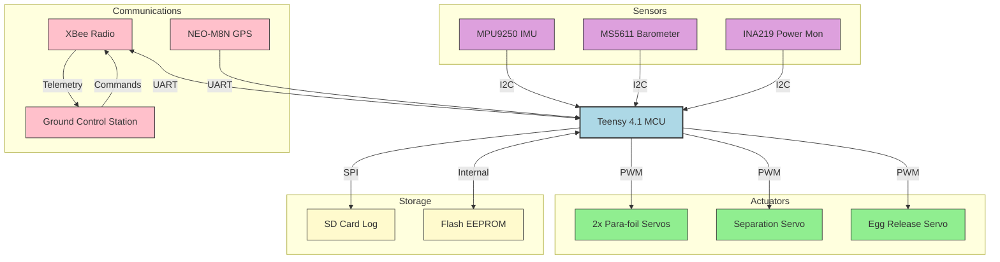
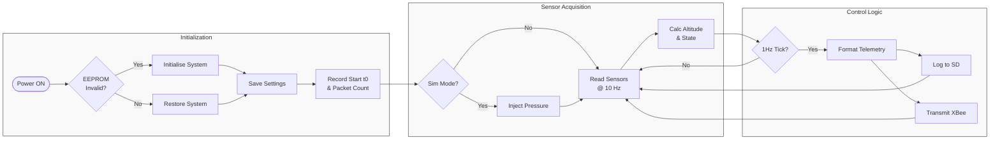
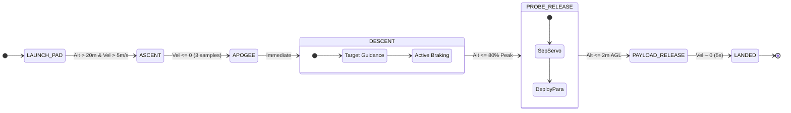
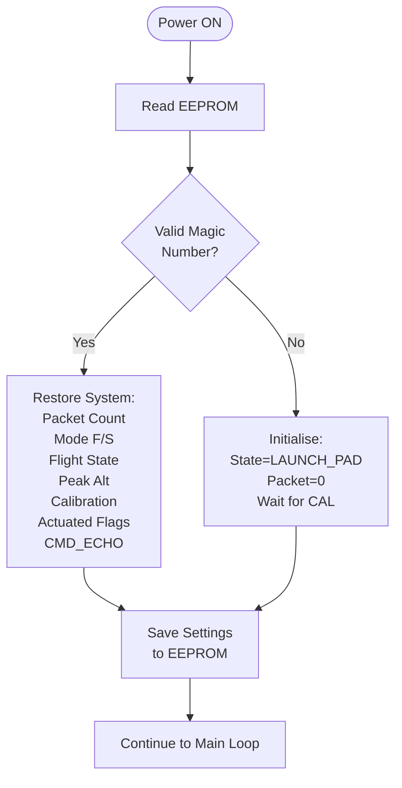

# FSW PDR Diagrams (Mermaid)

These diagrams correspond to the ASCII placeholders in `FSW_PDR_Slides.md`. You can view them in a Mermaid-compatible viewer or use the generated images.

## Slide 1: System Block Diagram

## Slide 3: Main Loop Logic

## Slide 4: Flight State Machine

## Slide 5: Recovery Logic

